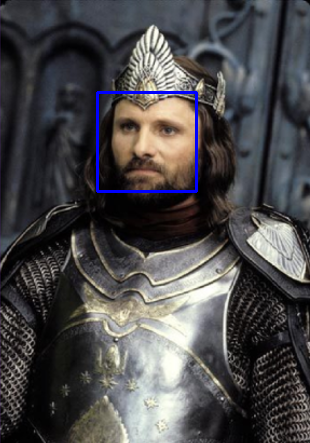

# Detecção de Faces com Python e OpenCV

Este repositório contém um script em Python para detecção de faces em uma imagem utilizando **OpenCV** e exibição do resultado com **Matplotlib**.  
O código lê uma imagem, aplica um classificador pré-treinado de face frontal, desenha retângulos ao redor das faces detectadas e salva a imagem resultante em disco.

## Tecnologias utilizadas

- Python 3  
- OpenCV (`cv2`)  
- Matplotlib  

## Arquivos esperados

- `code.py` → script principal com o código de detecção de faces  
- `imagem.png` → imagem de entrada (na mesma pasta do `code.py`)  
- `resultado.png` → imagem gerada com as faces detectadas  

## Como executar

1. Instale as dependências (via `pip`):

```bash
pip install opencv-python matplotlib
```

2. Coloque o arquivo `imagem.png` na mesma pasta do `code.py`.

3. Execute o script:

```bash
python code.py
```

4. Após a execução:
- Será exibida uma janela com a imagem detectada.  
- A imagem resultante será salva como `resultado.png`.



## Observações
- O classificador Haar Cascade já vem junto com o OpenCV.  
- Caso nenhuma face seja detectada, o script ainda salva a imagem normalmente.
